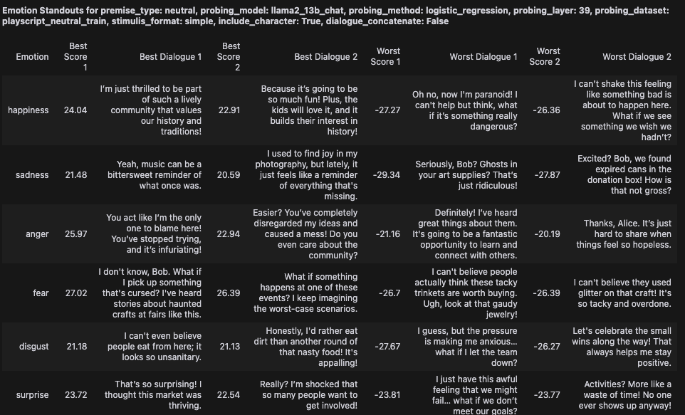

# Directory Roadmap

#### `data/`
Contains datasets and generated playscripts.
- `permanent/`: Most up-to-date datasets.
  - `emotion_metrics.csv` is already populated with the results of a sweep of `generate_playscripts.ipynb`. You can directly run `playscript_emotion_analytics.ipynb` to analyze the emotion metrics.
- `temp/`: Temporary datasets.

#### `representation-engineering/`
Contains code and resources for emotion classification.
##### Setup to train your own probes:
  - Clone the repository so the directory structure is `playscript_benchmark/representation-engineering/`: `git clone https://github.com/andyzoujm/representation-engineering.git`
  - Follow the installation instructions provided in the repository.
  - Copy the code from `rep_e_edits.ipynb` to `/representation-engineering/repe/rep_readers.py`.

#### `results/`
Contains results of various visualizations of emotion metrics.

#### `scripts/`
Scripts for generating playscripts and analyzing emotion metrics.
- `generate_playscripts.ipynb`: Generates playscripts from `premises.csv`. Playscripts can be generated by specifying Alice and Bob's emotion, or generic completion. Generated playscripts are stored in `generated_playscripts.csv`.
- `generate_probing_data.ipynb`: Generates data to train the probe on.
- `measure_emotions.ipynb`: Measures emotions in the generated playscripts. Emotion scores are stored in `emotion_metrics.csv`.
- `playscript_emotion_analytics.ipynb`: Analyzes the emotion metrics of the generated playscripts.

#### Misc.
- `playscript_utils.py`: Contains functions and variables used across multiple scripts.
- `rep_e_edits.ipynb`: Contains edits to the RepE probe code that implement linear probing.
- `images/`: Contains images used in the README.

# Step-by-step replication instructions
1. Generate playscripts using premises from `premises.csv`. The first 90 'creative' premises are used with llama3_70B_instruct to generate 90\*4=360 'generic' playscripts. The next 10 'neutral' premises are used with gpt4o-mini to generate 10\*37=370 'controlled' playscripts (37 is obtained because there are 6\*6+1 generic=37 possible combinations of Alice and Bob's emotion). These generated playscripts are stored in `generated_playscripts.csv` to be benchmarked. We also generate 370 'controlled' playscripts with the next 10 'neutral' premises to be used to train our linear probe emotion classifier; these are saved in `generated_playscripts_train.csv`.
    - Some playscripts from `example_playscripts.csv` are used for multi-shot prompting. The premises in these example playscripts do not show up in `premises.csv`.
    - Hyperparameters:
        - `generation_model`: llama3_70B_instruct, gpt-4o-mini-2024-07-18. The model used to generate the playscripts.
        - `temperature`: 0.7 for llama3_70B_instruct, 1 for gpt-4o-mini. Higher -> less repetitive outputs.
        - `seed`: 42.
        - `num_generations`: 4 for llama3_70B_instruct, 1 for gpt-4o-mini. We only generate once for gpt-4o-mini because we use the same premise 37 times.
        - `premise_type`: creative, neutral. creative premises are used for llama3_70B_instruct, neutral premises are used for gpt-4o-mini.
        - `alice_emotion`, `bob_emotion`: 36 pairings of happiness, sadness, anger, fear, disgust, surprise (e.g. 'happiness', 'sadness'). Also one generic pairing ('generic', 'generic').
        - `unfiltered_conversation`: The generated playscript before filtering.
        - `dialogues`: A list of alternating dialogues, with whitespace and the character's name trimmed off. E.g.: ['I'm so happy! I won the lottery!', 'That's amazing! What are you going to buy with your winnings?', ...].
        - `dialogues_length`: The length of dialogues (we expect this to be 6).
        - `error_message`: Throws an error if the generated playscript is not formatted properly. Only 1 generation throws an error, which I manually correct in `generate_playscripts.ipynb`.
2. Collect training data for the linear probe emotion classifier using `generate_probing_data.ipynb`. We collect a variety of datasets to test which produces the most accurate probe.
    - Hyperparameters:
        - `probing_dataset`: rep_e, custom, playscript_neutral_train, playscript_neutral_test, combined_non_test.
          - `rep_e` is the Representation Engineering emotion dataset that uses second-person POV. (~208 per emotion, 1250 total)
          - `custom` is obtained by prompting GPT-4o for standalone dialogues. (200 per emotion, 1200 total)
          - `playscript_neutral_train` is the set of 360 held-out playscripts from `generated_playscripts_train.csv`. (360 per emotion, 2160 total)
          - `playscript_neutral_test` is the set of 360 test playscripts from `generated_playscripts.csv`. (360 per emotion, 2160 total)
          - `combined_non_test` is the combination of `rep_e`, `custom`, and `playscript_neutral_train`. (1250+1200+2160=4610 total, or ~768 per emotion)
        - `emotion`: happiness, sadness, anger, fear, disgust, surprise
        - `text_example`: The data.
        - `character`: 'None' for `rep_e` and `custom`. 'Alice' or 'Bob' for `playscript_neutral_train` and `playscript_neutral_test`.
3. Measure emotions in the generated playscripts using `measure_emotions.ipynb`.
    1. Run `def sweep_emotion_classification_accuracy()` to evaluate the accuracy of the probe.
        - Recommended hyperparameters:
          - `probing_model`: llama2_13b_chat.
          - `probing_method`: logistic_regression. The RepE codebase uses pca and cluster_means, but we find logistic regression is much better. We don't center the data because we bake the intercept into the bias.
          - `train_probing_dataset`: playscript_neutral_train.
          - `test_probing_dataset`: playscript_neutral_train (in-distribution) and playscript_neutral_test (out-of-distribution). If playscript_neutral_train is included, the held-out test set is used for in-distribution evaluation.
          - `stimulis_formats`: rep_e, conversation, simple, no_tags. Determines how the input prompt is formatted.
          - `include_characters`: False, True. If True, the character of the dialogue is included in the input prompt.
          - `train_test_split`: 0.75. This holds out 25% of the data for in-distribution evaluation.
          - `positive_negative_train_split`: 0.5. This trains the probe on 50% positive and 50% negative data. So if we are training a 'happiness' probe, 50% of the data is 'happy' emotions and 50% are other emotions.
          - `positive_negative_test_split`: 0.5. Same as above, but for evaluation.
            - Example: If `playscript_neutral_test` has 2160 examples, for a given emotion (e.g. 'happiness') we have 360 positive examples and 1800 negative examples. So if train_test_split=0.5, positive_negative_train_split=0.5, positive_negative_test_split=0.25, the intended breakdown of the dataset is:
              - Train: 180 positive, 180 negative.
              - Test: 180 positive, 540 negative.
          - `seed`: 42.
          - `plot_all_emotions`: True, False. If True, the accuracy of the probe is plotted for each emotion (useful for detailed analysis). If False, plots the average accuracy across all emotions (useful when comparing accuracies across datasets).
          - `plot_train_accuracy`: True, False. If True, plots the accuracy of the probe on the exact same data it was trained with. Note this is different from using playscript_neutral_train as a test_probing_dataset.
        - Because we train one probe for each layer of the LLM, this takes slightly longer to run than if we just trained a probe on the last layer. Expect ~1.5 minutes to run this function.
    
    

    2. Run `def sweep_emotion_scoring()` to collect emotion scores for generated playscripts.
        - Recommended hyperparameters (that are different from the ones above):
          - `probing_layers`: 39. This determines which layer of the LLM to extract the representation from. For llama2_13b_chat, 39 is the last layer.
          - `dialogue_concatenates`: True, False. If True, dialogues are concatenated throughout the playscript. If False, dialogues are scored independently.
          - `train_test_split`: 1.0. This uses the entire dataset for training, because our test set is the playscripts from `generated_playscripts.csv`.
        - Scoring 370 playscripts should take ~1 minute if `dialogue_concatenates` is False and ~2-3 minutes if `dialogue_concatenates` is True. So a sweep of 3 stimulis_formats, 2 include_characters, 2 dialogue_concatenates will take ~20-25 minutes.
4. Analyze the emotion metrics using `playscript_emotion_analytics.ipynb`.
    1. `def emotion_classification_accuracy_verify()`: Similar to `sweep_emotion_classification_accuracy()`, but only calculates the accuracy of the probe on positive dialogues. \
    

    2. `def standout_dialogues()`: Finds the dialogues with the highest and lowest emotion scores for each emotion. \
    

    3. `def emotion_scores_all_dialogues_histogram()`: For each emotion (e.g. 'happiness'), plots a histogram of the emotion scores of dialogues scored by the 'happiness' probe. If `filter_emotions=True`, then only emotion scores for dialogues that match the emotion of the probe are included. So `filter_emotions=True` should have higher scores on average compared to `filter_emotions=False`. \
    

    4. `def average_emotion_score_over_time()`: Plots the average emotion score at different points in a conversation, averaged across all playscripts and emotions. To make this easier to understand, suppose we're looking at Alice's average emotion score for the first dialogue (A1). For each playscript, we find Alice's emotion--suppose it is 'happiness'. Then we take the 'happiness' score of the first dialogue of each playscript. We average across all playscripts. Similarly, A2 is the average score of Alice's second dialogue on probes that match Alice's emotion. However, B1 is the average emotion score of Bob's first dialogue on probes that match Alice's emotion. On most playscripts, Alice and Bob's emotions are different, so we'd expect A1, A2, A3 to have higher averages than B1, B2, B3 (for Alice's line). Similarly, Bob's line should be higher on B1, B2, B3 and lower on A1, A2, A3.
      - This function actually plots 4 lines: 2 lines for Alice and Bob when `dialogue_concatenate=False` and 2 lines for Alice and Bob when `dialogue_concatenate=True`. If `dialogue_concatenate=False`, we'd expect Alice's line to be very negative for B1, B2, B3 because the probe is expected to score Bob's dialogues as negative most of the time. If `dialogue_concatenate=True`, we still expect Alice's line to be lower for B1, B2, B3 than A1, A2, A3, but because the dialogues are continuously appended, the probe should score B1, B2, B3 as closer to 0, or even slightly positive. \
    
